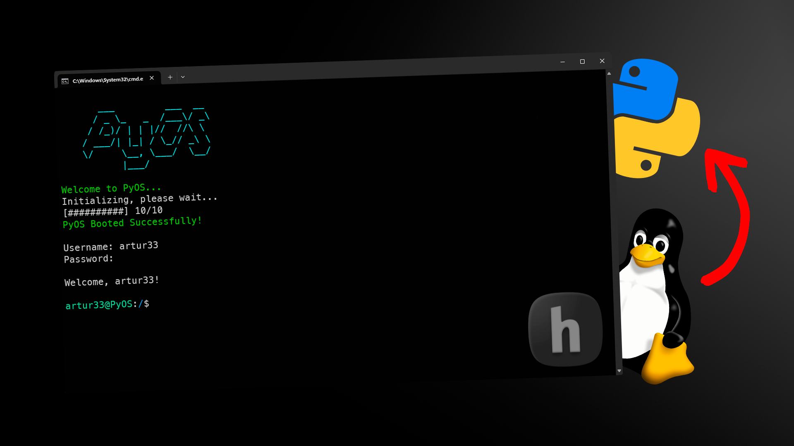

# PyOs-Bash



A Unix-like operating system simulator written in Python. PyOS provides a shell environment (bash-like) with file system and user management with Unix-style commands.

## Features
- **File system simulation:** with directory structure within a virtual file system.
- **System setup:** installation process, machine name setting, root password setting, user creation.
- **Package manager:** with remote package installation.
- **Python:** support with virtual environment (venv).
- **Permission and authentification system:** owner-based access control and multi-user support

## Available Commands
PyOS provides 36 commands in total: 34 are installed by default during system setup, and 2 additional commands (`nano` and `neofetch`) can be installed via the package manager:

| Command | Description | Usage |
|---------|-------------|-------|
| `cat` | Display file contents | `cat <filename>` |
| `cd` | Change directory | `cd <directory>` |
| `clear` | Clear the terminal screen | `clear` |
| `cp` | Copy files/directories | `cp [-r] <source> <destination>` |
| `curl` | Transfer data from servers | `curl [-X <method>, -H <header>, -d <data>, -o <output_file>, -i, -s] <url>` |
| `date` | Display current date and time | `date` |
| `echo` | Display text or write to file | `echo [text] > <filename>` |
| `find` | Search for files | `find <name_pattern>` |
| `last` | Show last login information | `last` |
| `logout` | Log out current user | `logout` |
| `ls` | List directory contents | `ls [-a]` |
| `man` | Display manual pages | `man <command>` |
| `mkdir` | Create directories | `mkdir <directory_name1> <directory_name2> …` |
| `mv` | Move/rename files | `mv <source> <destination>` |
| `nano` | Text editor | `nano <filename>` |
| `neofetch` | Display system information | `neofetch` |
| `passwd` | Change user password | `passwd [<username>]` |
| `ping` | Network connectivity test | `ping [-c <count>] <hostname>` |
| `pip` | Python package manager | `pip install/uninstall/list <package_name>` |
| `ps` | Display running processes | `ps` |
| `pwd` | Print working directory | `pwd` |
| `python` | Python interpreter | `python <file.py>` / `python -m venv <path>` |
| `rm` | Remove files/directories | `rm [-r] <file or directory1> …` |
| `rmdir` | Remove directories | `rmdir <directory_name1> …` |
| `snakepkg` | System package manager | `sudo snakepkg <install/remove/upgrade/list/available/info> <package_name>` |
| `source` | Execute commands from file | `source <file_path>` |
| `su` | Switch user | `su [<username>]` |
| `sudo` | Execute as root | `sudo <command> [args...]` |
| `touch` | Create empty files | `touch <file1> <file2> …` |
| `tree` | Display directory tree | `tree [directory]` |
| `uptime` | Show system uptime | `uptime` |
| `useradd` | Add new user | `useradd <username>` |
| `userdel` | Delete user | `userdel <username>` |
| `wget` | Download files | `wget [-O <output_file>, -P <directory>, -q] <url>` |
| `who` | Show logged in users | `who` |
| `whoami` | Display current username | `whoami` |

## Requirements
- **Python**: 3.6 or higher
- **Dependencies**: Install via `requirements.txt`
- **Internet connection**: internet connection for package manager features

## Installation (or you can use the .exe release)
1. **Clone the repository** and navigate to the project folder:
    ```bash
    git clone https://github.com/artur3333/PyOs-Bash.git
    cd PyOs-Bash
    ```

2. **Install the required Python packages**:
    ```bash
    pip install -r requirements.txt
    ```

## Directory Tree
```
PyOs-Bash/
├── auth.py             # User authentication and session management module
├── bootloader.py       # System bootloader
├── filesystem.py       # File system module
├── os_setup.py         # First-boot system setup module
├── package_manager.py  # Remote package installation/managment system module
├── shell.py            # Command interpreter and shell interface module
├── assets/
│   ├── bin/            # Default commands (34) - installed during setup
│   └── boot/
│       └── kernel.py   # System "kernel"
├── commands/           # Complete command repository (36 total commands)
│                       # ├── 34 commands (copied from assets/bin during setup)
│                       # └── 2 additional commands (nano, neofetch) available via package manager
└── fs/                 # Virtual file system (created on first boot)
    ├── bin/
    ├── boot/
    ├── etc/
    ├── home/
    ├── root/
    ├── var/
    └── ...             # Standard Unix directory structure
```

## Usage

### Starting PyOS
```bash
python bootloader.py
```

### Starting PyOS Release (.exe)
```bash
PyOS.exe
```

### Package Management
PyOS includes a built-in package manager that can install additional commands from a remote server. Currently, 2 additional commands are available for download:

```bash
# List available packages
snakepkg available

# Install nano text editor
sudo snakepkg install nano

# Install neofetch system info display
sudo snakepkg install neofetch

# Upgrade packages
sudo snakepkg upgrade
```
